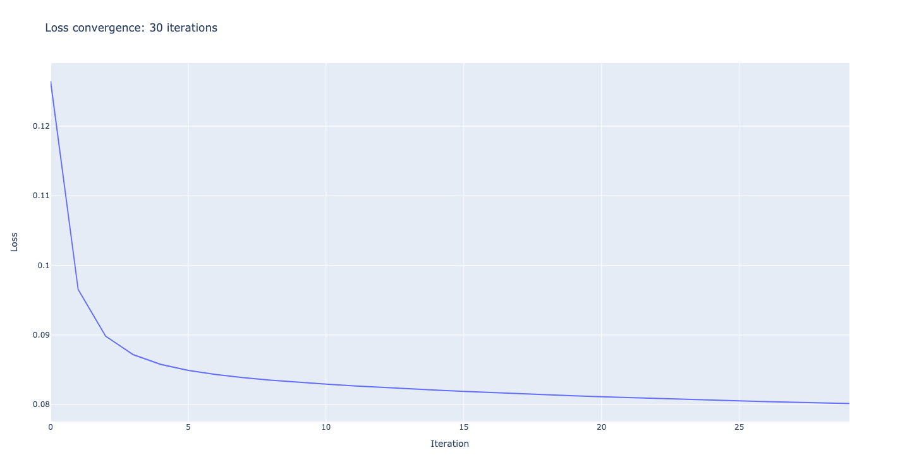

# Тестовое задание на летнюю стажировку в комаду CoreML Вконтакте

Задание: на датасете [MovieLens20M](https://www.kaggle.com/grouplens/movielens-20m-dataset/code)
сравнить два подхода к построению рекомендации:

- коллаборативный: используя только рейтинги. Например SVD-like алгоритмы, ALS, Implicit-ALS.

- коллаборативный + контентный: используя рейтинги и всю дополнительную информацию о фильмах, имеющуюся в датасете. Например LightFM.

Задачи:
1. Выбрать метрику и обосновать выбор.
2. Придумать и обосновать способ разбиения данных на обучение и валидацию.
3. Обратить внимание на сходимость обучения и настройку важных гиперпараметров моделей.
4. Оценить статистическую значимость результатов.

___

## 0. Чистка данных
Для начала почистим данные. Скрипт [`filter_data.py`](src/preprocessing/filter_data.py)
   считает, сколько составляет 1% от всех пользователей и удаляет из датасета
   фильмы с меньшим числом оценок. Размер исходного датасета после фильтрации сократился на 15%. 
   Этот шаг позволяет нам снизить разреженность матрицы рейтингов фильмов и пользователей. 
   
## 1. Выбор метрики 
Для того чтобы грамотно выбрать метрику необходимо уточнить задачу, которую мы решаем. 
   Пусть мы хотим, чтобы наша рекомендательная система на этапе `evaluation` выдавала каждому пользователю N рекомендаций фильмов. 
   Переведем пятибалльную рейтинговую шкалу в бинарную, в которой оценки выше или равные 4 будут соответствовать метке `1` – фильм понравился, 
   а остальные оценки метке `0` – фильм не понравился. 
   
   
В качестве метрики возьмем `precision@k`, наша задача – максимизировать выдачу релевантных рекомендаций, поэтому абсолютно все предсказания нас не интересуют, фокус на первых k. 
   Метрика `precision@k` как раз показывает долю релевантных рекомендаций в начале списка.
   

   Матрица рейтингов пользователей и фильмов сильно разреженная, 
   высока вероятность, что на валидационном датасете для каждого пользователя будет небольшое
   число размеченных данных, но подглядывать в тренировочные данные не хочется, 
   так как высока вероятность переобучиться, поэтому k следует взять побольше, в данной работе`k=25`.

**Notes:** 

- при расчете метрики на валидационном и тестовом датасете будем учитывать только пользователей, 
которые присутствовали и тренировочном и в тестовом / валидационном датасете;
  
- в качестве `true positive` в данной работе будем понимать фильмы, которые
были выданы моделью в качестве одной из рекомендаций в списке `top-k` и которые пользователь оценил 
выше 4 баллов;
  
- в качестве `false positive` в данной работе будем понимать фильмы, которые
были выданы моделью в качестве одной из рекомендаций в списке `top-k` и которым пользователь поставил
  оценку < 4 баллов. 

Недостатками такого подхода являются: невозможность оценить большинство рекомендаций модели (из-за отсутсвия
данных в валидационном / тестовом датасете),
а также не учет рангов рекомедаций. Однако, из-за прозрачности интерпретации оценки модели, остановимся на данной метрике.

## 2. Разбиение данных
Для разбиения датасета на тренировочный, валидационный и тестовый воспользуемся стратегией [`Temporal Global`](https://arxiv.org/pdf/2007.13237.pdf).
   Разобьем датасет – файл `raiting.csv` на тренировочный и валидационный согласно выбранной дате так, чтобы в тренировочный датасет попали все
   пользовательские действия, которые были совершены до выбранной даты, а в тестовый – оставшиеся. Затем повторим действия для разбиения на тренировочный и валидационный.
   Разбиение файла `raiting.csv` осуществляется с помощью запуска скрипта [`split_dataset.py`](src/preprocessing/split_dataset.py)
   с командной строки. 
   Размер тестового и валидационного датасета определяется случайным образом, но гарантировано попадает в заданный диапазон значений.
   Параметры разбиения заданы в [`util.py`](src/common/util.py). В нашем случае в тестовый датасет попало 49% данных, в валидационный 21% и в тестовый оставшиеся 30%.
 
  
## 3.1 Коллабаративный подход: ALS

Модель `ALS` может быть запущена для тренировки и расчета метрики `precision@25` на валидации с помощью скрипта [`model.py`](src/als/model.py).
В качестве настройки гиперпараметров был использован метод `RandomSearch` – наилучшие результаты, получились
   с параметрами:
   
         latent_dim = 20 (размер эмбедингов пользователей и фильмов)
         iterations = 30 (количетсво итераций до сходимости)
         alpha = 40 (константа alpha из оригинальной статьи, используемая при оценке уверенности)
         regularization = 0.1 (коэффициент регуляризации)

Если построить график лосса, можно увидеть, что примерно на 27 итерации алгоритм
выходит на плато:

Метрика `precision@25` практически не изменялась с количеством итераций: 0.69.

## 3.2 Коллаборативный + контентный подход LightFM

Для работы с алгоритмом LightFM были выбраны 2 матрицы: 
- матрица пользователей и фильмов, рейтинги
в который были заменены на значения: [-1, 0, 1]. Если пользователю не понравился фильм, 
  фильм не был оценен пользователем, и фильм был оценен пользователем на оценку выше 4 быллов
  соответственно; 
  
- матрица фильмов и тегов, в которой каждому фильму соответсвует значение релевантности 
конкретного тега конкретному фильму.
  
Код для запуска тренировки и оценки точности модели находится в скрипте [model.py](src/light_fm/model.py)

С этим алгоритмом на глубокий анализ параметров времени, к сожалению, не осталось,
запуск проводился с набором:

         latent_size = 10 
         learning_rate = 0.01
         item_alpha = 0
         epochs = 1

Полученная точность: `precision@25 = 0.74`
  

Ожидаемым результатом является более высокий показатель метрики точности с использованием 
коллобаративного + контентного подхода.

### #TODO
  
Так как время дедлайна подходит к концу, я оставляю ветку `main` без изменений, если 
это не противоречит правилам, пожалуйста, посмотрите ветку `develop` во время проверки, 
возможно, там уже появится оценка статистической значимости результатов и подбор гиперпараметров с hyperopt :)